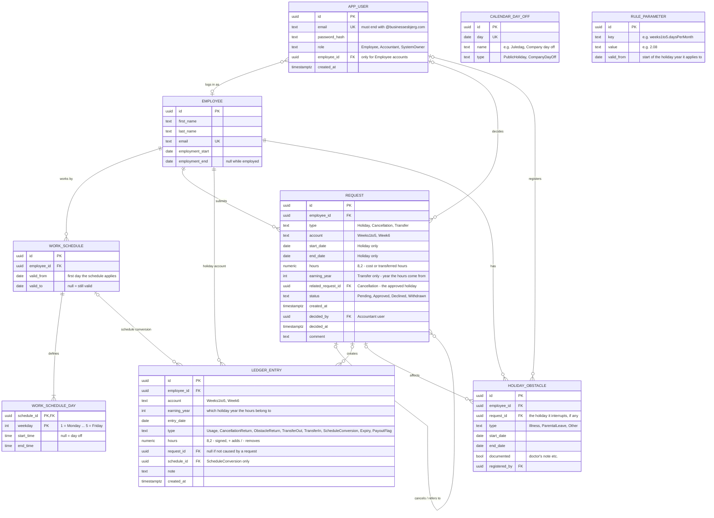

# Domain model (ERD)

```mermaid
erDiagram
  APP_USER }o--o| EMPLOYEE : "logs in as"
  EMPLOYEE ||--o{ WORK_SCHEDULE : "works by"
  WORK_SCHEDULE ||--|{ WORK_SCHEDULE_DAY : defines
  EMPLOYEE ||--o{ REQUEST : submits
  APP_USER |o--o{ REQUEST : decides
  REQUEST |o--o{ REQUEST : "cancels / refers to"
  EMPLOYEE ||--o{ LEDGER_ENTRY : "holiday account"
  REQUEST |o--o{ LEDGER_ENTRY : creates
  WORK_SCHEDULE |o--o{ LEDGER_ENTRY : "schedule conversion"
  EMPLOYEE ||--o{ HOLIDAY_OBSTACLE : has
  REQUEST |o--o{ HOLIDAY_OBSTACLE : "affects"
  APP_USER |o--o{ HOLIDAY_OBSTACLE : registers

  APP_USER {
    uuid id PK
    text email UK "must end with @businessesbjerg.com"
    text password_hash
    text role "Employee, Accountant, SystemOwner"
    uuid employee_id FK "only for Employee accounts"
    timestamptz created_at
  }

  EMPLOYEE {
    uuid id PK
    text first_name
    text last_name
    text email UK
    date employment_start
    date employment_end "null while employed"
  }

  WORK_SCHEDULE {
    uuid id PK
    uuid employee_id FK
    date valid_from "first day the schedule applies"
    date valid_to "null = still valid"
  }

  WORK_SCHEDULE_DAY {
    uuid schedule_id PK, FK
    int weekday PK "1 = Monday ... 5 = Friday"
    time start_time "null = day off"
    time end_time
  }

  CALENDAR_DAY_OFF {
    uuid id PK
    date day UK
    text name "e.g. Juledag, Company day off"
    text type "PublicHoliday, CompanyDayOff"
  }

  RULE_PARAMETER {
    uuid id PK
    text key "e.g. weeks1to5.daysPerMonth"
    text value "e.g. 2.08"
    date valid_from "start of the holiday year it applies to"
  }

  REQUEST {
    uuid id PK
    uuid employee_id FK
    text type "Holiday, Cancellation, Transfer"
    text account "Weeks1to5, Week6"
    date start_date "Holiday only"
    date end_date "Holiday only"
    numeric hours "8,2 - cost or transferred hours"
    int earning_year "Transfer only - year the hours come from"
    uuid related_request_id FK "Cancellation - the approved holiday"
    text status "Pending, Approved, Declined, Withdrawn"
    timestamptz created_at
    uuid decided_by FK "Accountant user"
    timestamptz decided_at
    text comment
  }

  LEDGER_ENTRY {
    uuid id PK
    uuid employee_id FK
    text account "Weeks1to5, Week6"
    int earning_year "which holiday year the hours belong to"
    date entry_date
    text type "Usage, CancellationReturn, ObstacleReturn, TransferOut, TransferIn, ScheduleConversion, Expiry, PayoutFlag"
    numeric hours "8,2 - signed, + adds / - removes"
    uuid request_id FK "null if not caused by a request"
    uuid schedule_id FK "ScheduleConversion only"
    text note
    timestamptz created_at
  }

  HOLIDAY_OBSTACLE {
    uuid id PK
    uuid employee_id FK
    uuid request_id FK "the holiday it interrupts, if any"
    text type "Illness, ParentalLeave, Other"
    date start_date
    date end_date
    bool documented "doctor's note etc."
    uuid registered_by FK
  }
```